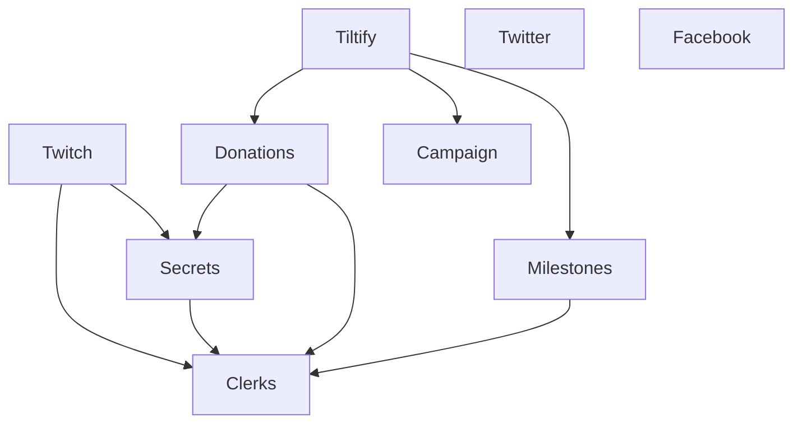

# Extensions

Extensions perform actions that either:

- Coordinate between the dashboard and the graphics (even for basic replicants); or
- Fetch data and marshal data from other APIs (to include as events or in replicants)

Ideally, all of the data from external systems would be subscribable, but sometimes we need to poll for data; in those cases, we should simulate an event driven system by polling, and either creating replicants or firing events (Replicants behave similarly enough to a pub-sub model).

Replicants should be used whenever non-transient, persistent data is required.

<!-- TODO: Actually draw out what you want to track -->

## Twitch

- Fetches data from Twitch and fires as events
- Posts to Twitch in response to events (from Twitch, other extensions)

## Tiltify

- Polls for donation information
- Polls for campaign information
- Creates events for the above
